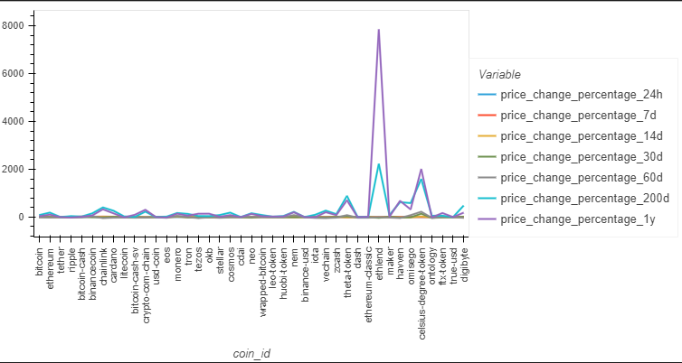
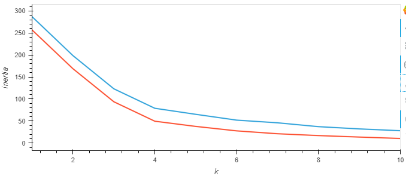
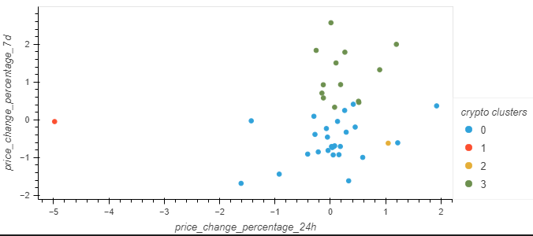
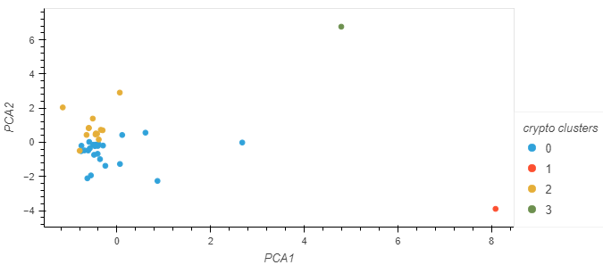

# CryptoClustering

CryptoClustering 

## Description:   

Using knowledge of Python, sklearn and unsupervised learning to create models that learn from data and then make decisions/predictions about future data, and then test the accuracy of those models. The machine learning model we create will group cryptocurrencies in the crypto_market_data.csv file to assist with assembling investment portfolios based on the profitability of the individual cryptocurrencies. 

## Technologies  

* Visual Studio Code
* python
* jupiter notebooks
* pandas, hvplot and sklearn python libraries
* KMeans and PCA clustering Machine Learning techniques

## Data Source  
All files and data used for this challenge were from the crypto_market_data.csv file.

## Important Documents
* logic.js
* style.css
* index.html
 

## Analysis  
My analysis and notes can be found within the Crypto_Clustering.ipynb file and the following images. 

* Visualizing the variables

* Comparing Scaled Data and PCA elbow plots

* Comparing KMeans and PCA cluster

## Contributors
In order to complete this challenge I utilized/relied on:
* Consultation with Erin Wills re correct data to use for clustering models
* google searches regarding KMeans and PCA clustering 
* ChatGPT

## Sources: 
* ChatGPT
* Google

